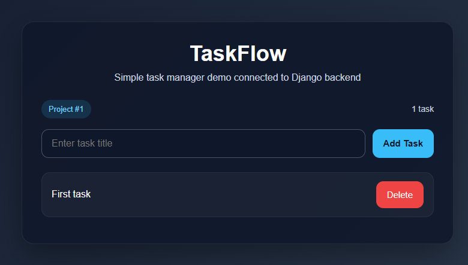

# 🚀 TaskFlow

TaskFlow is a task management backend application built with Django and Django REST Framework.  
It allows users to manage workspaces, projects, and tasks with a permission system and a simple demo UI.

---

## 🔥 Features

- 🔐 Custom user authentication (email-based login)
- 🏢 Workspaces with membership system (OWNER / MEMBER roles)
- 📁 Projects inside workspaces
- ✅ Task CRUD (Create, Read, Update, Delete)
- 🛡 Access control (only workspace members can access data)
- 🌐 REST API built with Django REST Framework
- 🎨 Simple demo UI (Django templates + JS)

---

## 🧱 Tech Stack

- Python 3
- Django
- Django REST Framework
- SQLite (for development)

---

## 📸 Demo

> Add your screenshot here:

---

## ⚙️ API Endpoints

### Tasks

- GET /projects/{project_id}/tasks/ → list tasks  
- POST /projects/{project_id}/tasks/ → create task  
- GET /projects/{project_id}/tasks/{task_id}/ → get task  
- PATCH /projects/{project_id}/tasks/{task_id}/ → update task  
- DELETE /projects/{project_id}/tasks/{task_id}/ → delete task  

---

## 🛠 Installation
git clone https://github.com/MeloRegon/taskflow.git
cd taskflow

python -m venv venv
source venv/bin/activate  # Windows: venv\\Scripts\\activate

pip install -r requirements.txt

---

## 🗄 Run Migrations
python manage.py migrate

---

## 👤 Create Superuser
python manage.py createsuperuser

---

## ▶️ Run Server
python manage.py runserver

---

## 🌐 Demo Page

Open in browser:
http://127.0.0.1:8000/demo/

---

## 📌 Project Structure
taskflow/
├── users/
├── workspaces/
├── projects/
├── tasks/
├── templates/
└── manage.py

---

## 💡 What I Learned

- Designing REST APIs with Django REST Framework  
- Implementing permission logic (workspace membership)  
- Using service layer for business logic separation  
- Working with class-based views (`APIView`)  
- Connecting backend with frontend (HTML + JS)  

---

## 📬 Contact

GitHub: https://github.com/MeloRegon
"""
path = "/mnt/data/README.md"
with open(path, "w", encoding="utf-8") as f:
    f.write(content)
print(path)